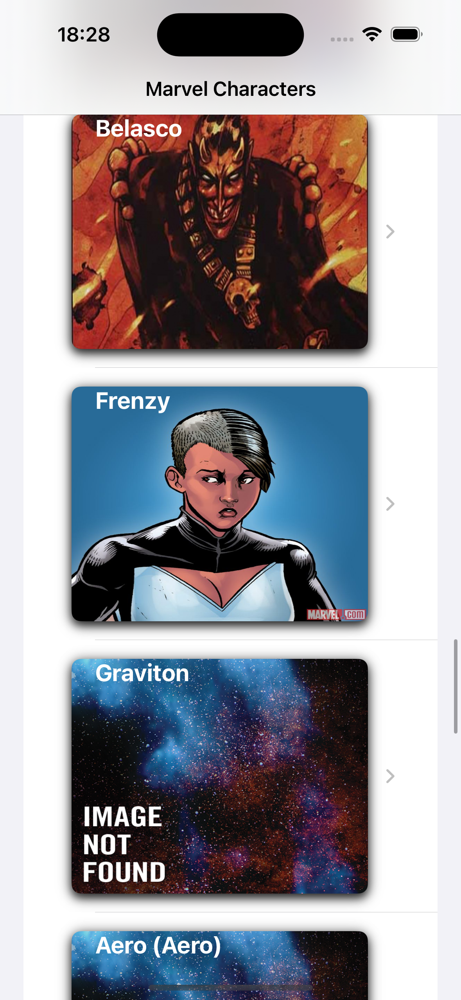
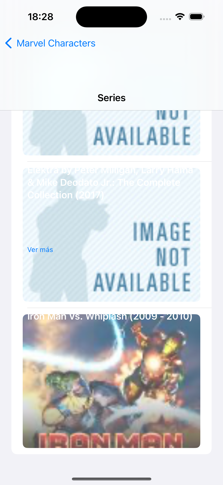
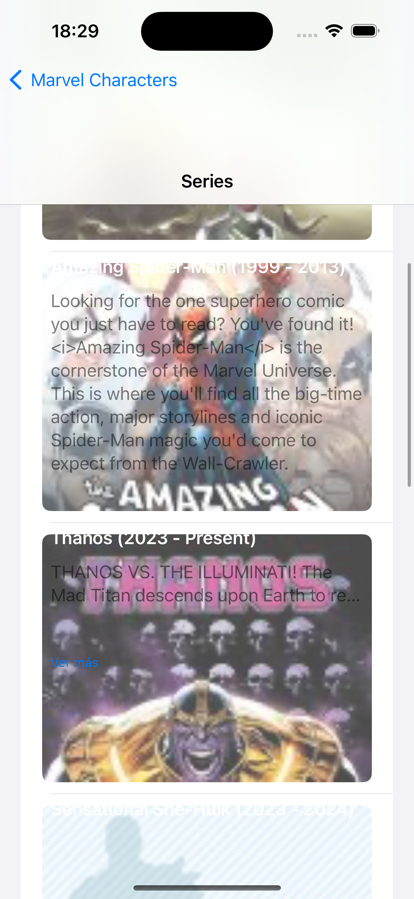

# KC Marvel SuperPowers

KC Marvel SuperPowers es una aplicación móvil desarrollada para dispositivos iOS que te permite explorar información sobre personajes y series del universo Marvel.

## Características

- **Explora personajes:** Descubre información detallada sobre los personajes icónicos de Marvel, incluyendo su descripción, imagen y más.
- **Explora series:** Conoce las series de cómics asociadas a tus héroes favoritos de Marvel.
- **Carga infinita:** La aplicación utiliza la carga infinita para cargar más personajes a medida que te desplazas por la lista.
- **Interfaz intuitiva:** Diseñada con una interfaz de usuario intuitiva y fácil de usar para una experiencia fluida de navegación.

## Capturas de pantalla

## Tecnologías Utilizadas

SwiftUI
Combine
URLSession para manejar las solicitudes HTTP
Codable para el manejo de datos JSON

## Requisitos de instalación

- Dispositivo con iOS 14.0 o superior.
- Conexión a internet para cargar datos desde la API de Marvel.

## Instalación

1. Clona o descarga el repositorio en tu máquina local.
2. Abre el proyecto en Xcode.
3. Configura las credenciales de la API de Marvel en el archivo `BaseNetwork.swift`.
4. Ejecuta la aplicación en un simulador o dispositivo iOS.

## Créditos

- **Desarrollador:** Daniel Cazorro Frías
- **API utilizada:** [Marvel Comics API](https://developer.marvel.com/docs)
